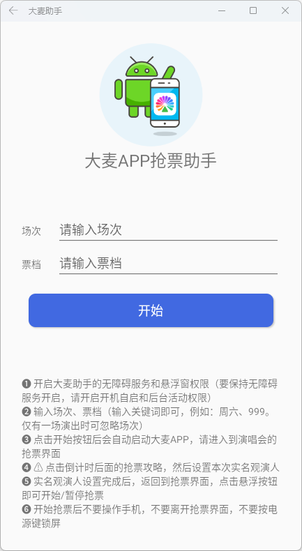

# DamaiHelper

### 介绍
大麦APP抢票助手

👉[点击前往下载](https://gitee.com/mtrdong/damai-helper/releases)

### 软件架构
支持 `API-26(Android8.0) ~ API-33(Android13)`

### 使用说明
1. 开启大麦助手的`无障碍服务`和`悬浮窗`权限（要保持无障碍服务开启，请开启`开机自启`和`后台活动`权限）
2. 输入`场次`、`票档`（输入关键词即可，例如：周六、999。仅有一场演出时可忽略场次）
3. 点击开始按钮后会自动启动大麦APP，请进入到演唱会的抢票界面
4. ⚠ 点击倒计时后面的`抢票攻略`，然后`设置本次抢票观演人`
5. 实名观演人设置完成后，返回到抢票界面，点击悬浮按钮即可`开始`/`暂停`抢票
6. 开始抢票后`不要`操作手机，`不要`离开抢票界面，`不要`按电源键锁屏

### 软件截图

# damaiapp
